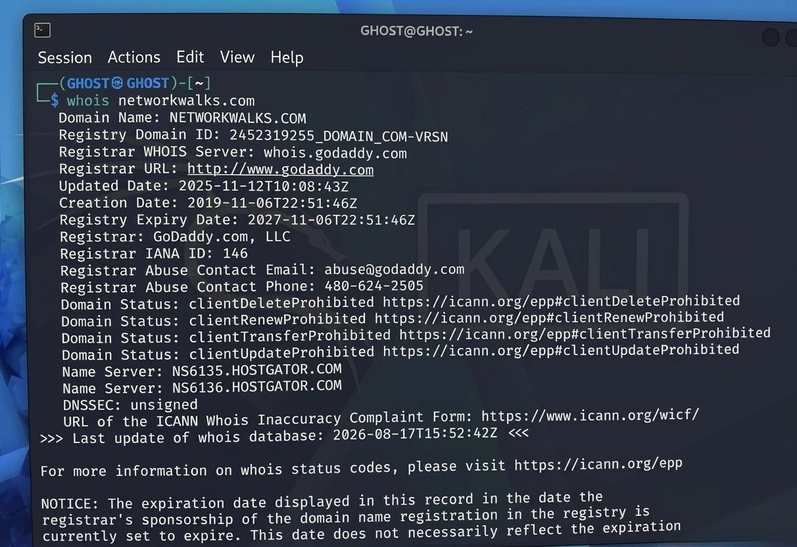
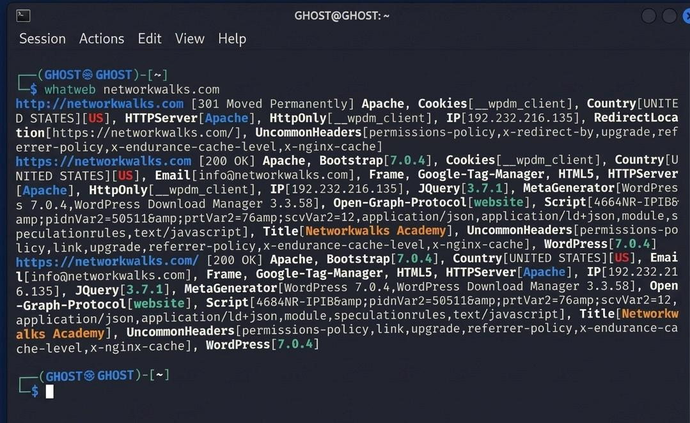
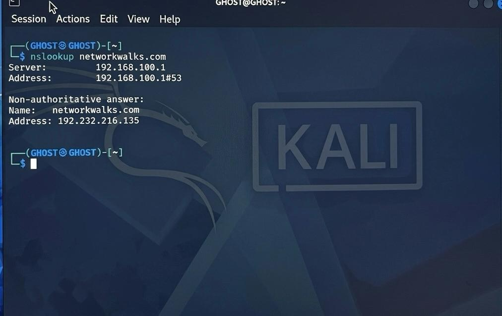
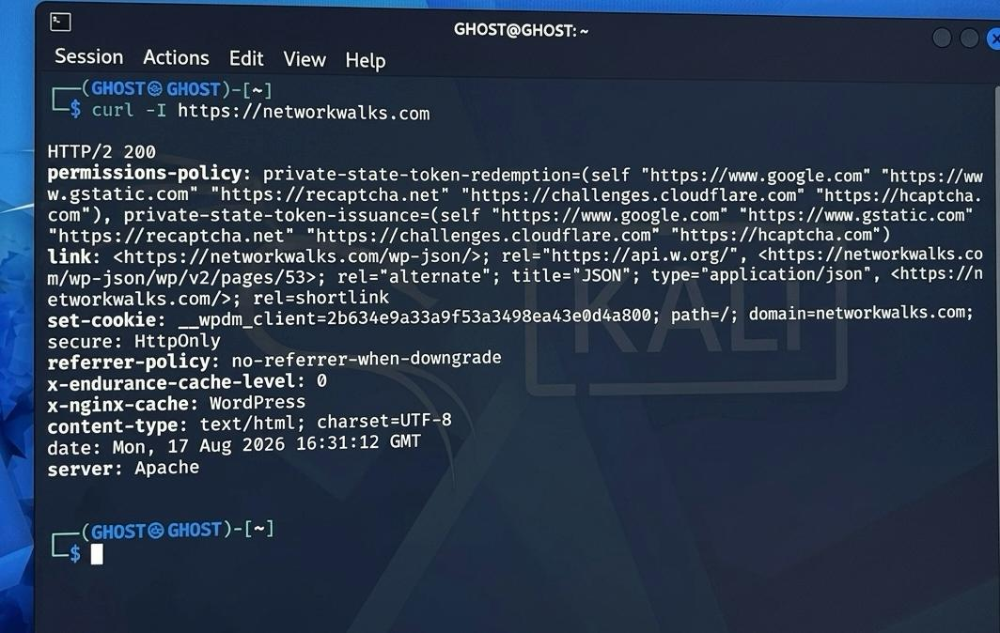
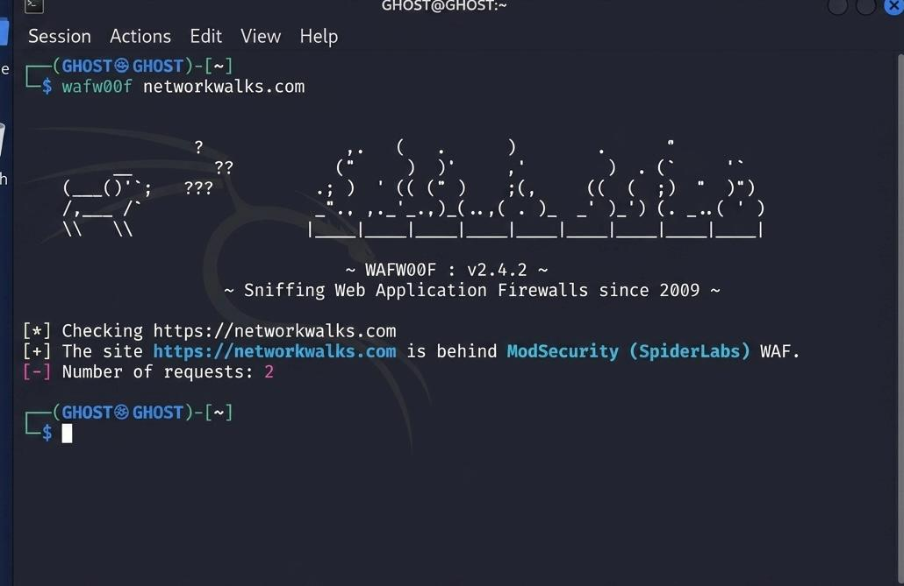
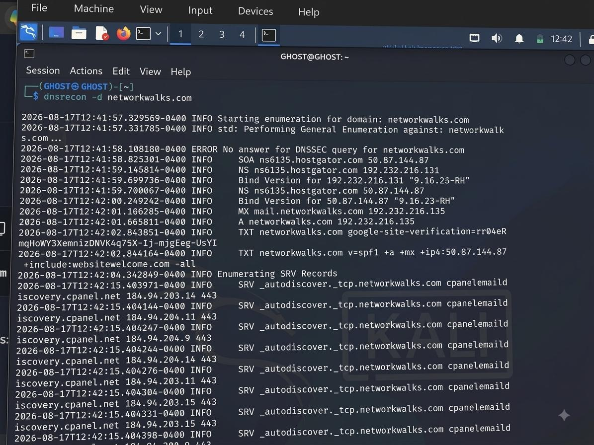
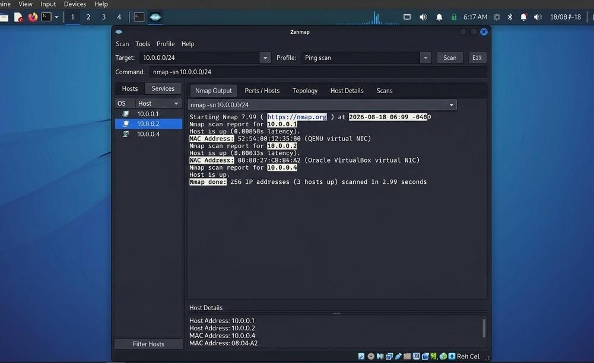
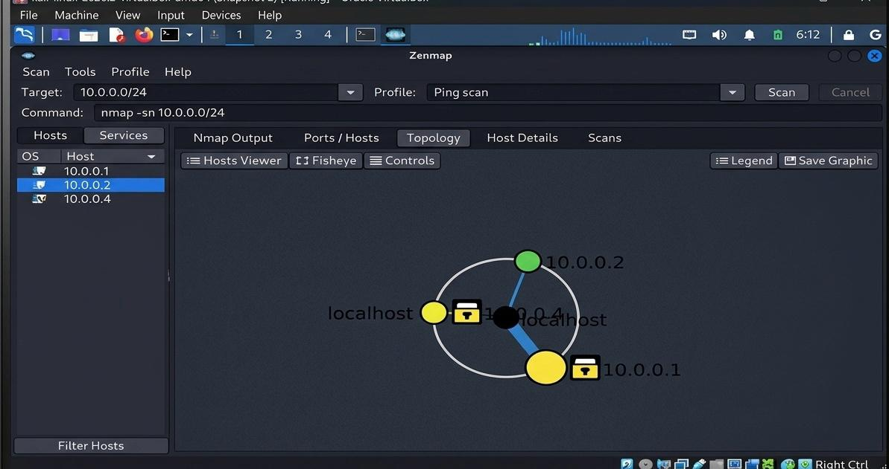

<div align="center">

<h1>  Cybersecurity Penetration Testing Report </h1>

### 🔴 Authorized Educational Security Assessment  

 **Pentester:**  Kovilen Sookalingum  
 **Date:**  August 2026  
 **Program / Batch:**  B082 – Networkwalks  
 
</div>

---

### Footprinting • Reconnaissance • DNS Enumeration • Web Fingerprinting • Network Discovery

> **GitHub Portfolio Edition | Authorized Educational Security Assessment**

---


<div align="center">

# ⚠️ Authorization & Disclaimer ⚠️

</div>

<div align="center">

      🚨 AUTHORIZED USE ONLY 🚨
></div>

 🚨I have performed these activities only on systems and devices where I had secured written permission or on devices and systems that I own myself.
>
>  🚨All materials in this repository are provided for **educational and research purposes only**. Do not use anything from this repository to break the law or to access systems without authorization.
>
>  🚨The instructor, authors, and Networkwalks are not responsible for how this knowledge is used. **Every action you take is your own responsibility.**
>
>  🚨Misuse of this knowledge can lead to **criminal charges, heavy fines, loss of employment, and a permanent record.**
>
>  🚨In many countries, **unauthorized access to computer systems is a crime, even when no damage is caused.**


---


<div align="center">

#  Project Overview

**Footprinting & Scanning Phases of Penetration Testing**

-WHOIS, WhatWeb, Nslookup, Curl, WAFW00F, DNSRecon *(Footprinting)*

-Zenmap host discovery, Zenmap topology *(Scanning)*

</div>

---


<div align="center">

#  Each Activity Includes
**Purpose • Command • Evidence • Observation • Security Relevance**

</div>

---

**Important:** Reconnaissance and discovery results are observations. They should not be represented as confirmed vulnerabilities unless additional authorized validation establishes exploitability.

---


#  Objectives

1. Identify publicly observable information associated with an authorized target.
2. Fingerprint technologies exposed by the web application.
3. Resolve domain and DNS information relevant to infrastructure mapping.
4. Inspect HTTP response headers for technical information disclosure.
5. Determine whether a Web Application Firewall is externally detectable.
6. Enumerate publicly available DNS records.
7. Identify live hosts on an authorized local network.
8. Record relevant IP and MAC addressing information.
9. Generate a network topology from the authorized discovery results.
10. Translate technical observations into security-relevant findings and recommendations.
11. Maintain reproducible evidence suitable for a professional GitHub portfolio.

---

##  Scope & Authorization

| Item | Description |
|---|---|
| **Assessment Type** | Authorized Educational Security Assessment |
| **Target** | `[Authorized domain / laboratory target]` |
| **Internal Network** | `[Tester-owned or explicitly authorized LAN]` |
| **Authorization** | `[Written authorization / self-owned environment / lab authorization]` |
| **Primary Activities** | Footprinting, reconnaissance, DNS enumeration, HTTP analysis, WAF identification and network discovery |
| **Excluded Activities** | Unauthorized exploitation, credential attacks, destructive testing, persistence, data theft and denial-of-service activity |

All activities must remain inside the documented scope.

---

##  Assessment Methodology

The assessment follows a reconnaissance-to-discovery workflow:

```text

                    ┌─────────────────────┐
                    │  Authorized Scope   │
                    └──────────┬──────────┘
                               │
                               ▼
                    ┌─────────────────────┐
                    │ Footprinting &      │
                    │ Reconnaissance      │
                    └──────────┬──────────┘
                               │
             ┌─────────────────┼─────────────────┐
             ▼                 ▼                 ▼
          WHOIS             WhatWeb          nslookup
             │                 │                 │
             └─────────────────┼─────────────────┘
                               ▼
                    ┌─────────────────────┐
                    │ HTTP / WAF / DNS    │
                    │ Analysis             │
                    └──────────┬──────────┘
                               │
                               ▼
                    ┌─────────────────────┐
                    │ Authorized Network  │
                    │ Discovery           │
                    └──────────┬──────────┘
                               ▼
                    ┌─────────────────────┐
                    │ Host Inventory &    │
                    │ Network Topology    │
                    └──────────┬──────────┘
                               ▼
                    ┌─────────────────────┐
                    │ Risk Analysis &     │
                    │ Recommendations     │
                    └─────────────────────┘


```

### Phase 1 — Footprinting & Reconnaissance


| Activity | Tool |
|---|---|
| Domain information | WHOIS |
| Technology fingerprinting | WhatWeb |
| DNS resolution | nslookup |
| HTTP header inspection | cURL |
| WAF identification | wafw00f |
| DNS enumeration | DNSRecon |


### Phase 2 — Network Discovery

| Activity | Tool |
|---|---|
| Host discovery | Zenmap / Nmap |
| Host inventory | Zenmap |
| Topology | Zenmap |

---


##  Tools & Technologies

| Tool | Purpose |
|---|---|
| **Kali Linux** | Security testing operating environment |
| **WHOIS** | Public domain registration and name-server information |
| **WhatWeb** | Web technology fingerprinting |
| **nslookup** | DNS resolution |
| **cURL** | HTTP response-header inspection |
| **wafw00f** | WAF identification |
| **DNSRecon** | DNS record enumeration |
| **Zenmap / Nmap** | Network discovery and scanning |

---

#  Phase 1 — Footprinting & Reconnaissance

## 1. WHOIS Enumeration

### Purpose

Obtain publicly available domain registration and authoritative name-server information.

### Command

```bash
whois [authorized-domain]
```

### Evidence



### Observation

Domain registered with GoDaddy, created on 2019‑11‑06, expires 2027‑11‑06. Name servers: NS6135.HOSTGATOR.COM and NS6136.HOSTGATOR.COM.
Security Relevance: Reveals registrar, hosting provider, and infrastructure metadata useful for external profiling.

### Security Relevance

WHOIS information can contribute to an external infrastructure profile by exposing registration-related metadata and authoritative name-server information.

---

## 2. WhatWeb Technology Fingerprinting

### Purpose

Identify web technologies and application/server characteristics exposed by the authorized website.

### Command

```bash
whatweb [authorized-domain]
```

### Evidence



### Observation

Apache server, WordPress 7.0.4, WordPress Download Manager 3.3.58, JQuery 3.7.1, Bootstrap 7.0.4, Google Tag Manager, Email contact info@networkwalks.com.

### Security Relevance

Technology and version disclosure may help a security professional identify components that require further authorized security review. Fingerprinting alone does not prove a vulnerability.

---

## 3. DNS Resolution — nslookup

### Purpose

Resolve the authorized domain and inspect DNS response information.

### Command

```bash
nslookup [authorized-domain]
```

### Evidence



### Observation

Domain resolves to IP 192.232.216.


### Security Relevance

Identifies the server’s network location for scanning and mapping.
 
---

## 4. HTTP Header Analysis — cURL

### Purpose

Inspect HTTP response headers returned by the authorized web service.

### Command

```bash
curl -I https://[authorized-domain]
```

### Evidence



### Observation

 Status HTTP/2 200, exposed endpoint /wp-json/, cookie __wpdm_client, Apache server banner, referrer policy no-referrer-when-downgrade.

### Security Relevance

HTTP headers can reveal implementation details and may expose unnecessary technical information. They should be reviewed in the context of the application's security configuration.

---

## 5. Web Application Firewall Identification

### Purpose

Determine whether a Web Application Firewall can be identified through external behavior.

### Command

```bash
wafw00f https://[authorized-domain]
```

### Evidence



### Observation

 Site protected by ModSecurity (SpiderLabs) WAF.

### Security Relevance

A detectable WAF is not itself a vulnerability. The result provides information about the defensive architecture and should be considered when interpreting later authorized testing.

---

## 6. DNS Enumeration — DNSRecon

### Purpose

Enumerate publicly available DNS records and infrastructure relationships.

### Command

```bash
dnsrecon -d [authorized-domain]
```

### Evidence



### Observation

SOA: ns6135.hostgator.com (50.87.144.87)

NS: ns6135.hostgator.com (192.232.216.131)

MX: mail.networkwalks.com (192.232.216.135)

TXT: Google site verification + SPF record

SRV: autodiscover records pointing to cpanel discovery servers

### Security Relevance

DNS records can provide useful information about name servers, mail infrastructure and other externally visible services. Unnecessary or obsolete records should be reviewed.

---

---

## 7. Zenmap Host Discovery

### Purpose

Identify live hosts within the authorized local network.

### Procedure

```text
Zenmap
→ Target: [Authorized subnet]
→ Profile: Ping Scan
→ Scan
```

### Evidence



### Observation

3 hosts up: 10.0.0.1, 10.0.0.2, 10.0.0.4.

### Security Relevance

Host discovery provides visibility into active devices and can help identify unexpected or undocumented assets on an authorized network.

---

## 8. Host Inventory

Populate this table from your actual Zenmap evidence.

| Host | IP Address | MAC Address | Observation |
|---|---|---|---|
| 01 | `10.0.0.1` | `[52:54:00:12:35:80 (QEMU)]` | Gateway / Router
| 02 | `[10.0.0.2]` | `[08:00:27:C8:86:A2 (VirtualBox)]` | Virtual Machine
| 03 | `[10.0.0.4]` | `[08:04:A2 (VirtualBox)]` | Virtual Machine
| 04 | `[10.0.0.5]` | `[Localhost]` | Tester workstation
| 05 | `[192.232.216.135]` | `[HostGator,(Apache Server) ]` |External authorized target

---

## 9. Network Topology

### Evidence



### Observation

 Topology shows interconnected hosts: localhost, 10.0.0.1, 10.0.0.2, 10.0.0.4.

### Security Relevance

A network topology helps communicate discovered relationships and provides a visual reference for asset documentation and future security reviews.

---

# ⚠️ Findings & Risk Analysis

> Findings below are structured as observations. Confirmed vulnerabilities require additional authorized validation.

| ID | Finding | Evidence / Observation | Risk | Recommendation |
|---|---|---|---|---|
| **F-01** | Web technology information exposed | `[WhatWeb identified Apache server, WordPress 7.0.4, WP Download Manager 3.3.58, JQuery 3.7.1, Bootstrap 7.0.4 ]` | Medium | Review public technology disclosure and maintain software |
| **F-02** | Server/IP information identifiable | `[Nslookup resolved domain networkwalks.com → 192.232.216.135 ]` | Low | Review externally exposed infrastructure information |
| **F-03** | HTTP technical information exposed | `[Curl headers showed /wp-json/ endpoint, Apache banner, cookie __wpdm_client, referrer policy ]` | Low | Minimize unnecessary technical disclosure |
| **F-04** | WAF technology identifiable | `[WAFW00F detected ModSecurity (SpiderLabs) protecting the site ]` | Low | Maintain and monitor the WAF |
| **F-05** | DNS infrastructure information exposed | `[DNSRecon enumerated SOA, NS, MX, TXT (SPF + Google verification), SRV autodiscover records ]` | Medium | Audit public DNS records |
| **F-06** | Multiple live hosts visible on authorized LAN | `[Zenmap scan discovered 10.0.0.1 (QEMU NIC), 10.0.0.2 (VirtualBox NIC), 10.0.0.4 (VirtualBox NIC), 10.0.0.5 (localhost) ]` | Medium | Maintain asset inventory and investigate unknown devices |

### Risk Rating

| Rating | Meaning |
|---|---|
| 🔴 **Critical** | Immediate, severe security impact requiring urgent remediation |
| 🟠 **High** | Significant security exposure requiring prioritized remediation |
| 🟡 **Medium** | Meaningful exposure that should be addressed |
| 🟢 **Low** | Limited security impact or information disclosure |
| 🔵 **Informational** | Observation with no demonstrated security impact |

---

# 🛠️ Recommendations


### 1. Review Technology Exposure

**Periodically review publicly observable technologies, CMS components, plugins and server information**


### 2. Patch & Configuration Management

Keep operating systems, CMS platforms, plugins and supporting services updated and aligned with current security advisories.


### 3. Review HTTP Headers

Review HTTP response headers and minimize unnecessary technical disclosure while maintaining required application functionality.


### 4. DNS Hygiene

Audit public DNS records regularly and remove obsolete or unnecessary records.


### 5. WAF Maintenance

Keep the WAF appropriately configured, monitored and maintained.


### 6. Internal Asset Discovery

Perform authorized periodic network discovery to maintain an accurate asset inventory.


### 7. Investigate Unknown Devices

Unexpected hosts should be validated against the organization's approved asset inventory.


### 8. Network Documentation

Maintain current network diagrams, addressing information and device ownership documentation.


### 9. Authorized Security Testing


All deeper vulnerability validation must remain within an approved scope and documented authorization.


---

# Evidence Index

| Figure | Evidence |
|---|---|
| 01 | WHOIS |
| 02 | WhatWeb |
| 03 | nslookup |
| 04 | cURL HTTP headers |
| 05 | wafw00f |
| 06 | DNSRecon |
| 07 | Windows ipconfig |
| 08 | Zenmap host discovery |
| 09 | Zenmap topology |

> **GitHub publication:** redact passwords, API keys, tokens, credentials, unnecessary personal information and sensitive internal data before committing screenshots to a public repository.

---

#  Lessons Learned

- Reconnaissance is a structured information-gathering process.
- Different tools provide different views of the same environment.
- DNS, HTTP metadata and technology fingerprints can contribute to an infrastructure profile.
- Network discovery improves visibility of authorized assets.
- Evidence, interpretation, risk and recommendation should be clearly separated.
- Technical observations should not automatically be described as vulnerabilities.
- Professional security testing requires authorization and clearly defined scope.
- GitHub documentation should be reproducible, readable and safe to publish.

---


## 👤 Author

**Kovilen Sookalingum**


**GitHub:** `[https://github.com/GHOST-HUNTER10/cybersecurity-B082-week-02-penetration-testing-Report.git]`

**Program:** B082 - Networkwalks

**Week:** 02

**Date:** August 2026


