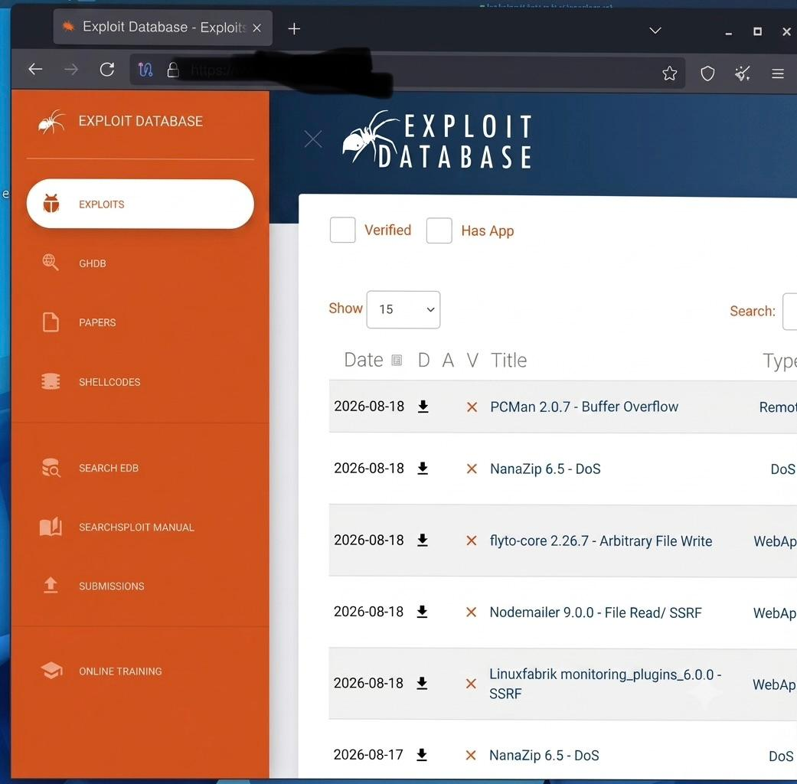
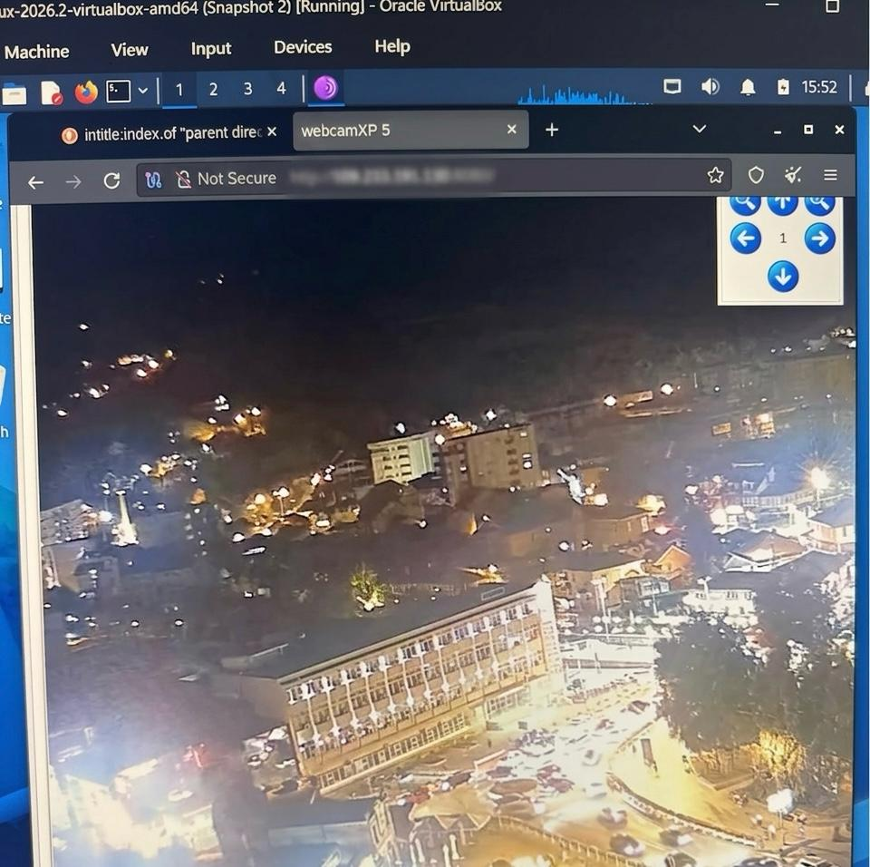
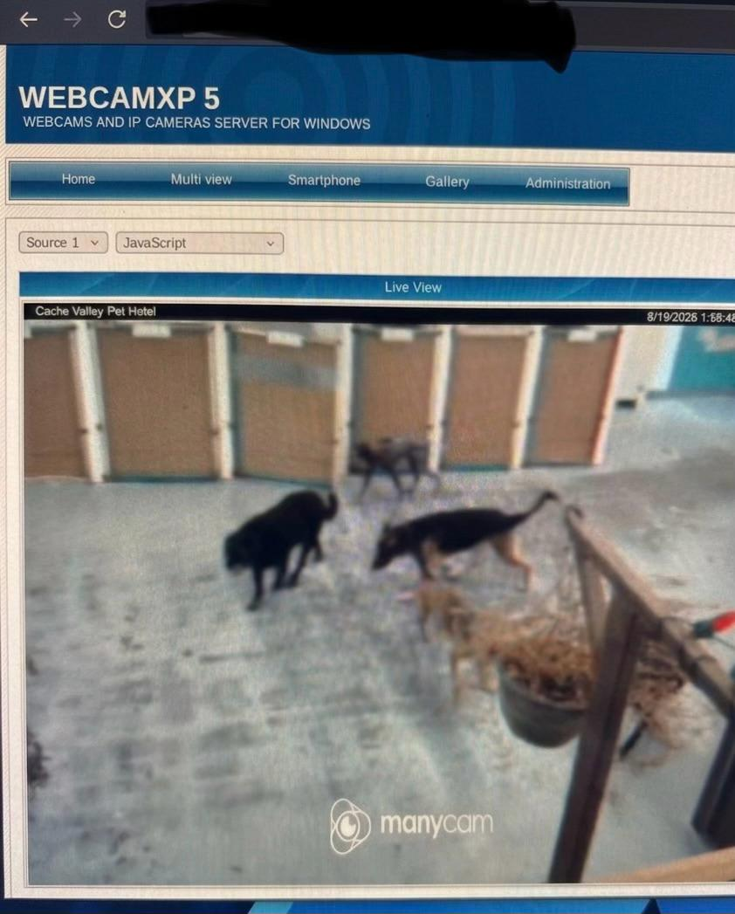
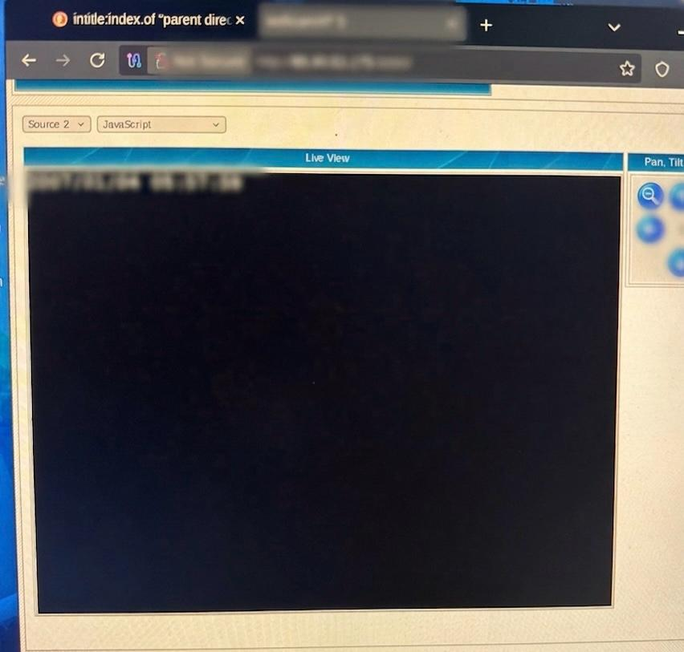
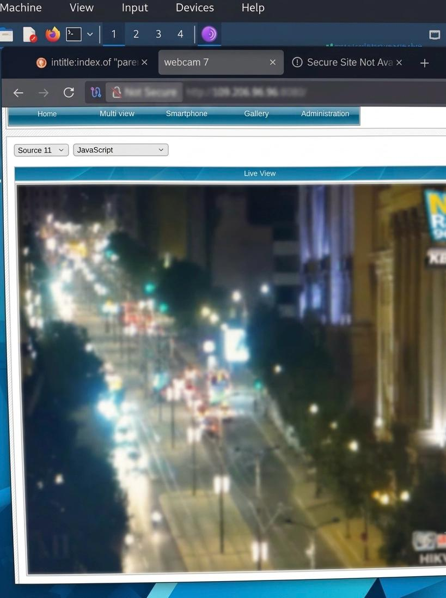
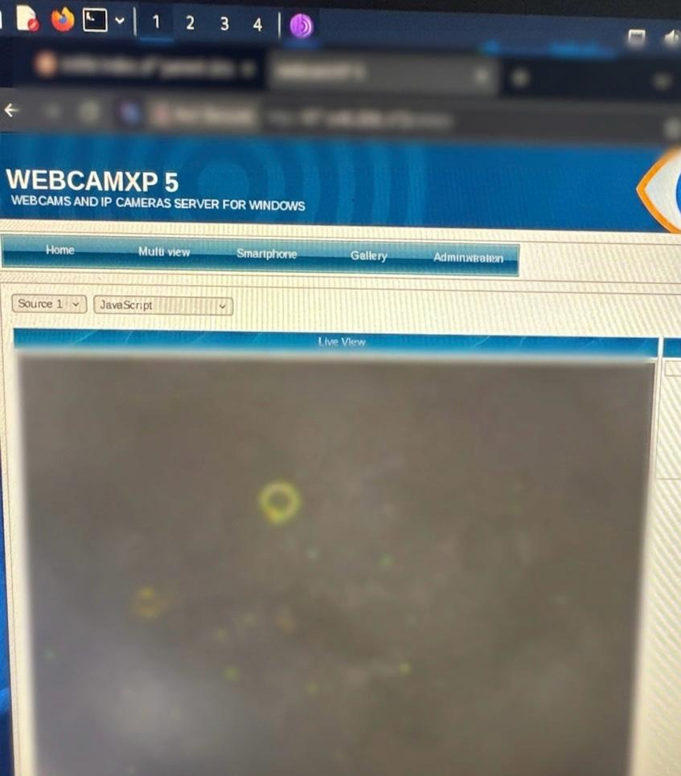
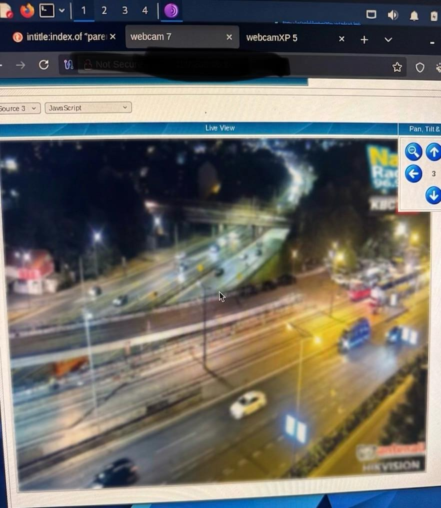
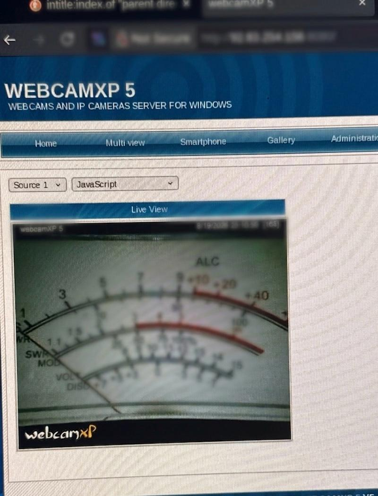
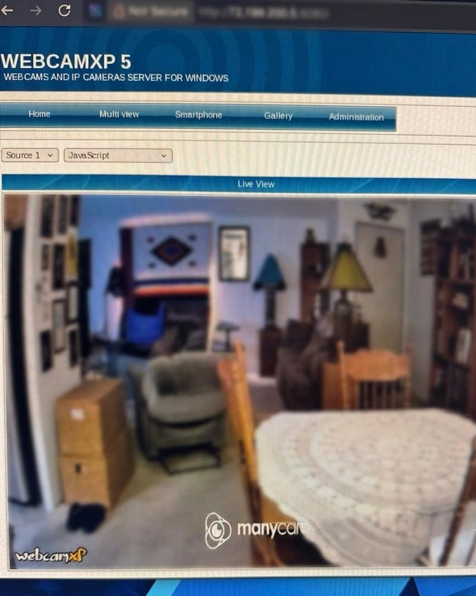

# <p align="center"> Penetration Testing Report</p>
<p align="center">
</p>


## GHDB-Based Footprinting & Reconnaissance
### Professional Penetration Testing Report

<p align="center">

| | |
|---|---|
| **Assessment Type** | ✅ Authorized Security Assessment (Educational) |
| **Pentester** | Kovilen Sookalingum |
| **Date** | August 2026 |
| **Module** | Week 02 — Project Module 2 (PM2) |
| **Status** | 🟢 Complete |

</p>

---

# ⚠️ Disclaimer ⚠️

> **Educational Use Only**
>
> This repository was created for cybersecurity education and ethical-hacking research.
>
> No unauthorized access, exploitation, password guessing, authentication bypass, modification, or collection of private information was performed.
>
> Any security testing must be conducted only against systems that you own, your own laboratory environment, or systems for which you have explicit written authorization.
>
> Unauthorized access to computer systems or networks may be illegal.
>
> The author does not encourage or support unauthorized access, surveillance, exploitation, or misuse of the techniques described in this project.

---

# <p align="center"> Assessment Scope</p>

This repository documents my **Week 02 Cybersecurity Project**, focused on **Footprinting and Reconnaissance using the Google Hacking Database (GHDB)**.

The purpose of this project is to understand how publicly indexed information can be discovered through search engines using specially constructed search queries known as **Google dorks**.

The project focuses on reconnaissance rather than exploitation.

The exercise demonstrates how search engines can index web interfaces and other publicly accessible resources, and why organizations should regularly review their Internet-facing exposure.

---

# <p align="center"> Executive Objectives</p>

The objectives of this project were to:

* Understand the concept of Google Hacking Database (GHDB).
* Understand Google dorking as a reconnaissance technique.
* Identify publicly indexed security-camera interfaces.
* Document the search queries used during reconnaissance.
* Understand the security implications of exposed services.
* Practice professional penetration-testing documentation.
* Apply ethical hacking and responsible security-research principles.

---

# Tools & Technologies

| Tool                               | Purpose                                   |
| ---------------------------------- | ----------------------------------------- |
| **Google Search**                  | Search-engine reconnaissance              |
| **Google Hacking Database (GHDB)** | Source of Google dorks                    |
| **Exploit-DB**                     | GHDB reference                            |
| **Kali Linux**                     | Cybersecurity research environment        |
| **GitHub**                         | Project documentation and version control |

---

#  What is GHDB?

 
 
The **Google Hacking Database (GHDB)** is a collection of search queries designed to locate information that has already been indexed by search engines.

These queries are commonly called **Google dorks**.

Google dorks use search operators such as:

```text
intitle:
inurl:
site:
filetype:
```

to make search results more specific.

For example:

```text
intitle:"webcamXP" inurl:8080
```

can be used to search for pages containing characteristics associated with webcamXP web interfaces.

The Week 02 project material introduces GHDB as a reconnaissance resource for identifying publicly indexed information such as exposed cameras, open directories, login pages, configuration files and documents.

---

# Footprinting & Reconnaissance

Footprinting is the process of collecting information about a target environment before performing further security testing.

Reconnaissance can help a security professional understand:

* What services are publicly visible
* What technologies may be exposed
* What information search engines have indexed
* Whether unnecessary services are Internet-facing
* Whether security controls are correctly configured

In an ethical penetration test, reconnaissance should always remain within the agreed scope of the assessment.

---

# Methodology

The methodology used for this project was:

```text
        GHDB
          │
          ▼
   Select relevant dork
          │
          ▼
    Search using Google
          │
          ▼
   Review search results
          │
          ▼
 Identify relevant result
          │
          ▼
 Document the finding
          │
          ▼
 Apply ethical limitations
```

### Step 1 — Access GHDB

The Google Hacking Database was used as a reference for identifying relevant search queries.

### Step 2 — Identify a camera-related dork

A camera-related GHDB query was selected.

Example:

```text
intitle:"webcamXP" inurl:8080
```

### Step 3 — Search Google

The query was entered into Google Search.

### Step 4 — Review the indexed results

Search results were reviewed to identify pages matching the characteristics of the selected query.

### Step 5 — Document the finding

Relevant findings were recorded together with the corresponding search query.

### Step 6 — Maintain ethical boundaries

No attempt was made to bypass authentication, guess passwords, exploit systems, or obtain private information.

---

# Task 1 — Security Camera Reconnaissance

## Objective

The objective of Task 1 was to identify **10 publicly indexed security-camera interfaces** using relevant GHDB search queries.

The project instructions provide a webcamXP example using:

```text
intitle:"webcamXP"
inurl:8080
```

The exercise is intended to demonstrate reconnaissance through search engines.

---

# Google Dork Examples

The following types of queries were used during the reconnaissance exercise:

### WebcamXP

```text
intitle:"webcamXP" inurl:8080
```

### WebcamXP 5

```text
intitle:"webcamXP 5"
```

### Webcam URL

```text
inurl:webcam
```

### WebcamXP URL

```text
inurl:webcamXP
```

### WebcamXP Server

```text
"my webcamXP server!"
```

These queries demonstrate how search operators can be combined with application-specific keywords to narrow search results.

---

# Task 1 Findings

For ethical public documentation, the identifying IP addresses of third-party camera systems are **redacted**.

The original findings were recorded during the practical exercise, while the public GitHub report uses sanitized entries.

| No. | Endpoint        | Relevant Dork                                        | Username / Password |
| --: | --------------- | ---------------------------------------------------- | ------------------- |
|   1 | `REDACTED:8080 ` | `intitle:"webcamXP" inurl:8080`                     | N/A                 |
|   2 | `REDACTED:8080` | `intitle:"Webcam and IP cameras server for Windows"` | N/A                 |
|   3 | `REDACTED:880`  | `intitle:"webcamXP 5"`                               | N/A                 |
|   4 | `REDACTED:8080` | `intitle:"webcamXP 5"`                               | N/A                 |
|   5 | `REDACTED:8080` | `intitle:"webcamXP 5"`                               | N/A                 |
|   6 | `REDACTED:8080` | `intitle:"webcamXP 5"`                               | N/A                 |
|   7 | `REDACTED:8080` | `inurl:webcam`                                       | N/A                 |
|   8 | `REDACTED:8080` | `inurl:webcamXP`                                     | N/A                 |
|   9 | `REDACTED:8080` | `inurl:webcam`                                       | N/A                 |
|  10 | `REDACTED:8080` | `inurl:webcamXP`                                     | N/A                 |

> **Note:** No username or password was used or tested. `N/A` indicates that no credentials were part of the reconnaissance documentation.

---

# Evidence & Screenshots | Screenshot Privacy

<p float="left">
  
  
</p>

<p float="left">
  
  
</p>

<p float="left">
  
  
</p>

<p float="left">
  
        
</p>


Sensitive information should be blurred or cropped where appropriate.

This includes:

* Public IP addresses
* Personal information
* Private content
* Credentials
* Identifiable camera feeds

The screenshots should demonstrate the **methodology and search process**, not expose unnecessary private information.

---

---

# Finding Interpretation

A search-engine result should not automatically be interpreted as proof that a device is vulnerable.

The result demonstrates that a page associated with a particular service or application was indexed by a search engine.

Potential security concerns may include:

* Unnecessary Internet exposure
* Privacy risks
* Information disclosure
* Weak security configuration
* Outdated software
* Increased attack surface
* Potential unauthorized access if authentication controls are inadequate

Further assessment would require explicit authorization from the system owner.

---

# Defensive Security Recommendations

Organizations operating Internet-connected cameras should consider the following security controls.

## 1. Restrict Internet Exposure

Security cameras should not be directly exposed to the public Internet unless there is a legitimate operational requirement.

---

## 2. Use Strong Authentication

Default credentials should be changed.

Strong passwords should be used for administrative accounts.

Where supported, additional authentication controls should be enabled.

---

## 3. Update Firmware

Camera systems and associated software should be regularly updated to address known security vulnerabilities.

---

## 4. Use Network Segmentation

Security cameras should be separated from critical business systems using appropriate network segmentation.

---

## 5. Restrict Remote Administration

Administrative interfaces should only be accessible through controlled and authorized methods.

---

## 6. Disable Unnecessary Services

Unused services and Internet-facing interfaces should be disabled whenever possible.

---

## 7. Monitor Search-Engine Exposure

Organizations should periodically search their own domains and assets to determine what information is publicly indexed.

---

# <p align="center"> Task 2 — Mathematics PDF Listings</p>

<p align="center">
  <strong>Objective:</strong> Identify 10 publicly indexed mathematics PDF directories using GHDB search queries.<br>
  <strong>Assessment Type:</strong> Authorized Security Assessment (Educational)<br>
  <strong>Pentester:</strong> Kovilen Sookalingum<br>
  <strong>Assessment Date:</strong> August 2026<br>
  <strong>Module:</strong> Week 02 — Project Module 2 (PM2)
</p>

---

# <p align="center">Findings Table</p>

| No. | Link | Relevant Dork | Username / Password |
|----:|------|---------------|---------------------|
| 1 | https://www.skylineuniversity.ac.ae/pdf/math/ | `intitle:index.of "parent directory" mathematics pdf` | --- |
| 2 | https://archive.org/details | `intitle:index.of "parent directory" mathematics pdf` | --- |
| 3 | https://www.free-ebooks.net/mathematics | `intitle:index.of "parent directory" mathematics pdf` | --- |
| 4 | https://www.magmath.com/ | `intitle:index.of "parent directory" mathematics pdf` | --- |
| 5 | https://www.gutenberg.org/ebooks/33283 | `intitle:index.of "parent directory" mathematics pdf` | --- |
| 6 | https://infobooks.org/free-pdf-books/math/ | `intitle:index.of "parent directory" mathematics pdf` | --- |
| 7 | https://carma.newcastle.edu.au/brailey/Lecture_Notes/ | `intitle:index.of "parent directory" mathematics pdf` | --- |
| 8 | https://www.cuteboyprogrammers.com/pdf/Math/ | `intitle:index.of "parent directory" mathematics pdf` | --- |
| 9 | https://www.homeschoolmath.net/teaching/pdfs/ | `intitle:index.of "parent directory" mathematics pdf` | --- |
| 10 | https://ocw.mit.edu/courses/mathematics/ | `intitle:index.of "parent directory" mathematics pdf` | --- |

---

# <p align="center"> Lessons Learned — Task 2</p>

### 1. Search engines index more than expected  
Even academic and educational repositories can be discovered through simple Google dorks. Organizations should be aware that their directory structures and file listings may be publicly visible.

### 2. GHDB queries reveal open resources  
The same dorks used by attackers to find sensitive files can also surface legitimate educational materials. This demonstrates the dual‑use nature of reconnaissance techniques.

### 3. Discovery ≠ exploitation  
Finding a directory listing does not mean exploitation has occurred. The exercise was limited to reconnaissance and documentation, without downloading or misusing any files.

### 4. Importance of directory configuration  
Open “index of” listings may unintentionally expose internal file structures. Administrators should configure web servers to disable auto‑indexing unless explicitly required.

### 5. Defensive monitoring  
Security teams can use GHDB queries against their own domains to identify unintended exposure of documents, lecture notes, or internal resources.

### 6. Ethical boundaries  
Reconnaissance should remain within authorized scope. In this project, only publicly available educational repositories were documented, with no attempt to access private or copyrighted material.

---

<p align="center">
  <strong>Conclusion:</strong> Task 2 reinforced that reconnaissance is not only about finding vulnerable devices, but also about understanding how ordinary search queries can reveal open educational resources. Organizations should balance accessibility with security by controlling what directories are indexed by search engines.
</p>

# <p align="center">Notes</p>

<p align="center">
  All links point to publicly available educational repositories.<br>
  No copyrighted or private materials were downloaded or redistributed.<br>
  This exercise demonstrates how Google indexing can surface open resources and why organizations should configure directories securely.
</p>

---


#  Ethical Scope

This project was conducted strictly for **educational and ethical-security research purposes**.

The objective was to understand how publicly indexed information can be identified using search engines.

No unauthorized access or exploitation was performed.

The project did not involve:

* Password guessing
* Brute-force attacks
* Authentication bypass
* Exploitation
* Privilege escalation
* Modification of remote systems
* Installation of malware
* Collection of private information
* Unauthorized access to camera feeds
* Persistence on remote systems

The project material emphasizes that security testing should be performed only against systems owned by the tester, laboratory environments, systems with written authorization, or systems covered by an authorized professional agreement.

---

# 🚨 Responsible Disclosure

If a security researcher discovers an exposed service during authorized research, the responsible approach is to:

1. Stop unnecessary interaction with the system.
2. Avoid accessing private information.
3. Record only the minimum information necessary.
4. Preserve appropriate evidence.
5. Identify the responsible organization where possible.
6. Report the exposure through an appropriate security contact.
7. Avoid publicly publishing sensitive information.

---

#  Security Risk Summary

| Risk                      | Description                                    | Recommended Control          |
| ------------------------- | ---------------------------------------------- | ---------------------------- |
| Internet-facing camera    | Camera interface may be publicly discoverable  | Restrict network access      |
| Weak authentication       | Unauthorized access may become possible        | Strong authentication        |
| Outdated software         | Known vulnerabilities may remain exploitable   | Patch and update             |
| Unnecessary services      | Additional attack surface                      | Disable unused services      |
| Poor network segmentation | Compromise may affect other systems            | Segment IoT/security devices |
| Search-engine indexing    | Public exposure may reveal service information | Review public indexing       |

---

#  Lessons Learned

This project provided practical experience with search-engine-based reconnaissance.

The main lessons learned were:

### 1. Search engines can reveal significant information

Organizations may unintentionally expose information through publicly indexed services.

### 2. GHDB can assist reconnaissance

GHDB provides predefined search techniques that help security researchers understand what may be discoverable.

### 3. Discovery is not exploitation

Finding an indexed page does not mean that the researcher should attempt to gain unauthorized access.

### 4. Security exposure should be assessed responsibly

A finding should be documented without unnecessarily exposing sensitive information.

### 5. Defenders can use the same techniques

Security teams can perform controlled searches against their own assets to identify unintended exposure.

---

#  Project Reflection

This exercise demonstrated the importance of reconnaissance during penetration testing.

Before attempting any technical exploitation, a security professional should understand what information is already publicly available.

Google dorking provides an example of how ordinary search-engine functionality can be used for security research.

From a defensive perspective, the exercise demonstrates the importance of:

* Proper access controls
* Secure network architecture
* Regular patching
* Strong authentication
* Service minimization
* Continuous exposure monitoring

The most important lesson from the exercise is that **security is not only about protecting systems from direct attacks; it is also about controlling what information is unintentionally exposed to the public Internet.**

---

# ✅ Project Completion

| Project Component          | Status              |
| -------------------------- | ------------------- |
| GHDB research              | ✅ Completed        |
| Reconnaissance methodology | ✅ Completed        |
| Camera-related dorks       | ✅ Documented       |
| Task 1 findings            | ✅ Documented       |
| Task 2 findings            | ✅ Documented       |
| Ethical scope              | ✅ Documented       |
| Security recommendations   | ✅ Completed        |
| GitHub documentation       | ✅ Completed        |

---

---

#  Conclusion

The Week 02 GHDB project demonstrated how search engines can be used as a reconnaissance source during security assessments.

The exercise showed that publicly indexed services can provide useful information about an organization's Internet-facing attack surface.

The findings also demonstrate why organizations should regularly review their public exposure and ensure that security devices and services are properly protected.

The purpose of ethical hacking is not simply to discover weaknesses, but to **understand, document and ultimately help remediate them responsibly.**

---


---

# <p align="center">Report Author</p>

<p align="center">
This report was prepared and documented by <b>Kovilen Sookalingum</b>  
for <i>Cybersecurity B082 — Week 02, Project Module 2</i>.  
All findings are presented for educational and ethical‑hacking purposes only.
</p>


</p>
