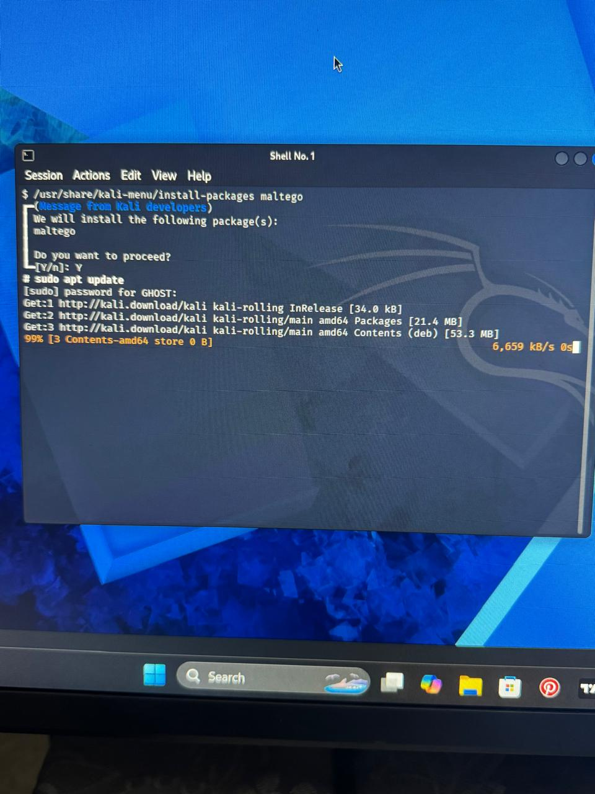
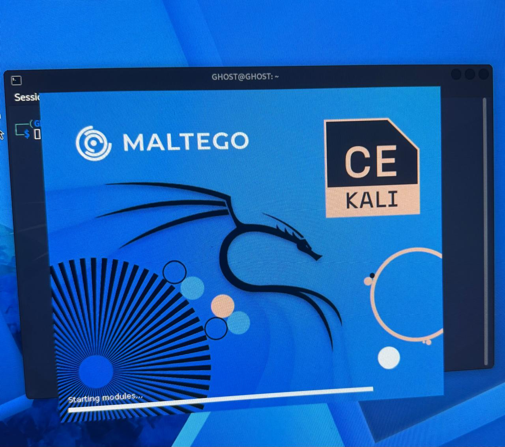
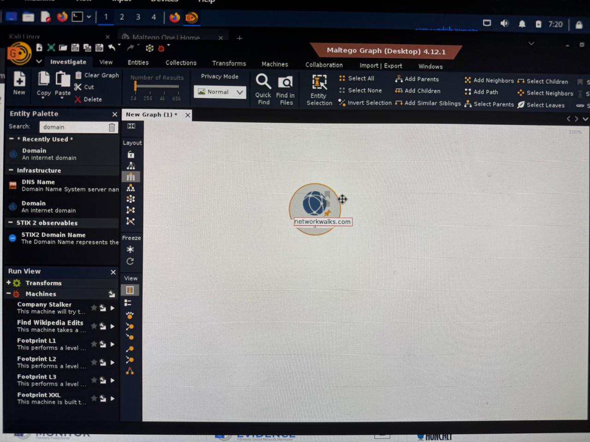
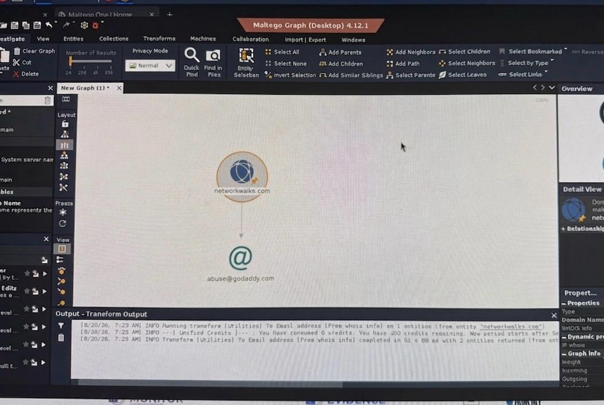
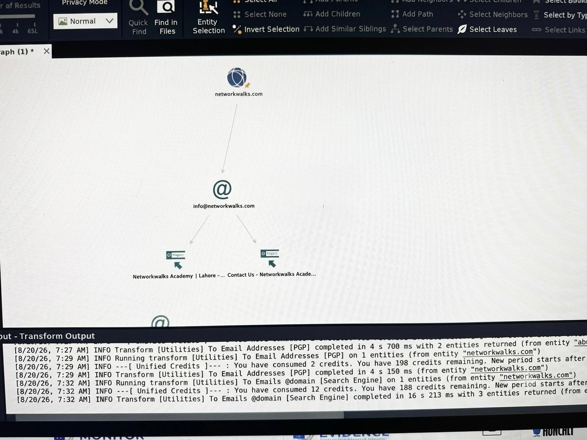

#  Penetration Testing Report

## OSINT Reconnaissance Assessment — [networkwalks].com

| Field | Detail |
|-------|--------|
| **Project Title** | OSINT Reconnaissance Assessment — `[networkwalks].com` |
| **Date of Assessment** | August 20, 2026 |
| **Assessor** | Kovilen Sookalingum |
| **Methodology** | Maltego CE OSINT Workflow |
| **Classification** | Educational / Research Use Only |

---

## 1. Executive Summary

An Open Source Intelligence (OSINT) reconnaissance engagement was conducted against the target domain **`[networkwalks].com`** using **Maltego Community Edition (CE)** on **Kali Linux**. The objective was to passively gather publicly available information — WHOIS registration data, registrar details, associated email addresses, and related web infrastructure — without direct interaction with the target's servers.

**Key Results:**

- Registrar identified: GoDaddy  
- Registrar abuse contact: `abuse@godaddy.com`  
- Organizational contact email: `info@[REDACTED].com`  
- Related web properties: “Networkwalks Academy | Lahore – Contact Us”  

**Risk Classification:** `INFORMATIONAL / RECONNAISSANCE EXPOSURE`

---

## 2. Scope

| Category | Detail |
|----------|--------|
| **Target** | `[REDACTED].com` |
| **Assessment Type** | Passive OSINT |
| **Tools Used** | Maltego CE v4.12.1, Kali Linux |
| **Data Sources** | WHOIS, Search Engine, PGP key servers |
| **Out of Scope** | Exploitation, brute-force, phishing, active scanning |

---

## 3. Methodology

### Phase 1 — Installation & Environment Setup
- Installed Maltego CE via Kali package manager (`sudo apt install maltego`)  
- Registered Maltego CE account  
- Verified launch with splash screen  

# Evidence:  
 
 

---

### Phase 2 — Graph Workspace Creation
- Created new blank graph  
- Verified entity palette availability  

 Evidence:  
 

---

### Phase 3 — Target Entity Configuration
- Added **Domain** entity  
- Configured value: `[REDACTED].com`  

 Evidence:  
 

---

### Phase 4 — Transform Execution
- WHOIS → Discovered `abuse@godaddy.com`  
- PGP → Discovered `info@[REDACTED].com`  
- Search Engine → Found related “Contact Us” page  

📸 Evidence:  
 
---

## 4. Findings

### F-001 — Registrar Abuse Email Disclosure
- **Severity:** Medium  
- **Data:** `abuse@godaddy.com`  
- **Impact:** Registrar-specific social engineering, domain transfer fraud attempts  
- **Recommendation:** Enable WHOIS privacy, monitor abuse contact  

---

### F-002 — Organizational Email Address Disclosure
- **Severity:** Medium  
- **Data:** `info@[REDACTED].com`  
- **Impact:** Phishing, credential stuffing, social engineering  
- **Recommendation:** Segregate public/internal email, deploy SPF/DKIM/DMARC  

---

### F-003 — Related Web Properties Enumeration
- **Severity:** Informational  
- **Data:** “Networkwalks Academy | Lahore – Contact Us”  
- **Impact:** Organizational profiling, physical reconnaissance  
- **Recommendation:** Audit public-facing content, train staff on OSINT risks  

---

## 5. Risk Summary

| Severity | Count | Findings |
|----------|-------|----------|
| 🔴 Critical | 0 | — |
| 🟠 High | 0 | — |
| 🟡 Medium | 2 | F-001, F-002 |
| 🔵 Low | 0 | — |
| ⚪ Informational | 1 | F-003 |

---

## 6. Recommendations

1. **Enable WHOIS Privacy** (F-001)  
2. **Deploy SPF/DKIM/DMARC** (F-002)  
3. **Segregate Public vs Internal Email** (F-002)  
4. **Periodic OSINT Audits** (All)  
5. **Audit Public-Facing Content** (F-003)  

---

## 8. Conclusion

This assessment demonstrated how OSINT tools like Maltego can reveal valuable intelligence from a single domain.  
-  Public emails increase phishing risk  
-  Registrar details enable social engineering  
-  Related web properties aid profiling  

**Defensive takeaway:** Organizations must continuously monitor their public footprint and reduce unnecessary exposure.

---

## 9. Appendix — Glossary

- **OSINT:** Open Source Intelligence  
- **WHOIS:** Domain registration database  
- **Transform:** Maltego query to a data source  
- **Entity:** Node in Maltego graph (Domain, Email, etc.)  
- **SPF/DKIM/DMARC:** Email authentication protocols  

---

**End of Report**  
**Kovilen Sookalingum**  
**Cybersecurity & Ethical Hacking Project**  
**August 20, 2026**
