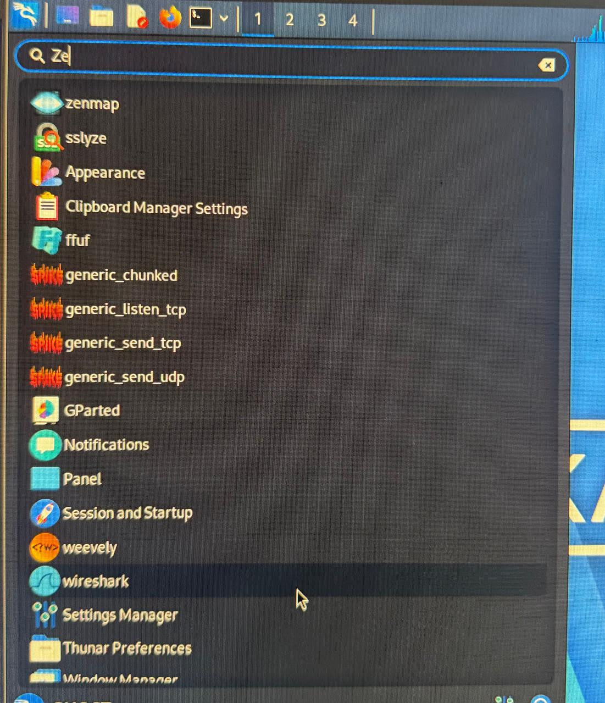
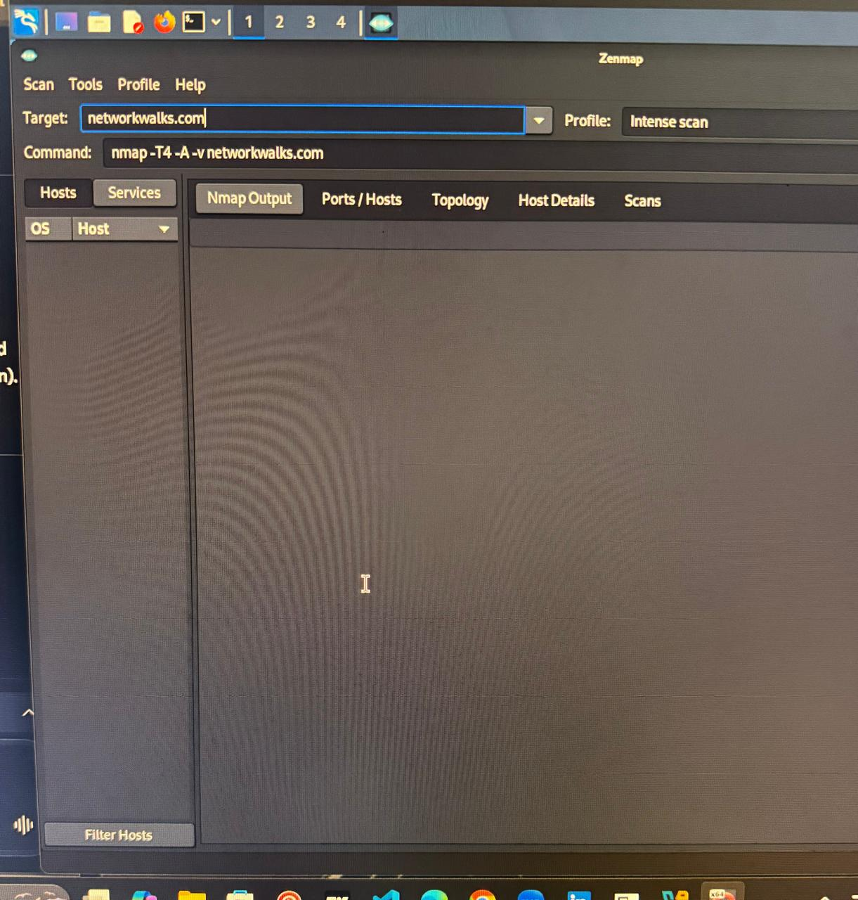
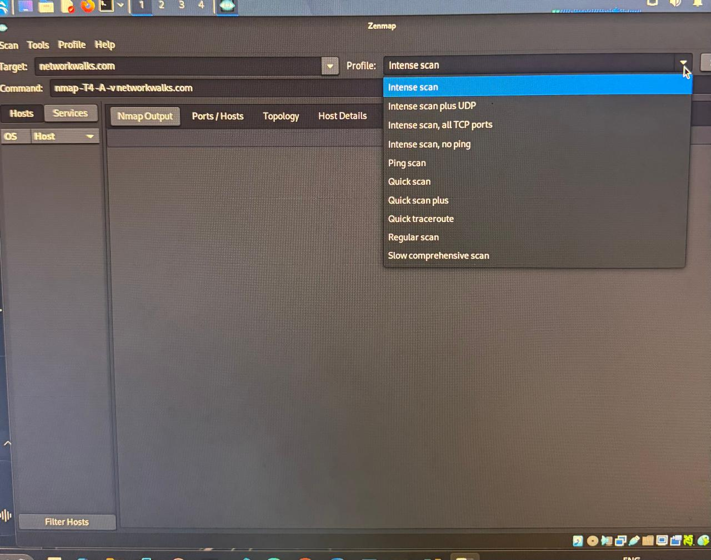
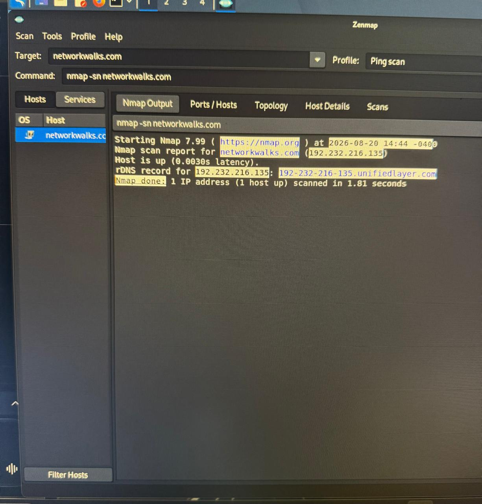
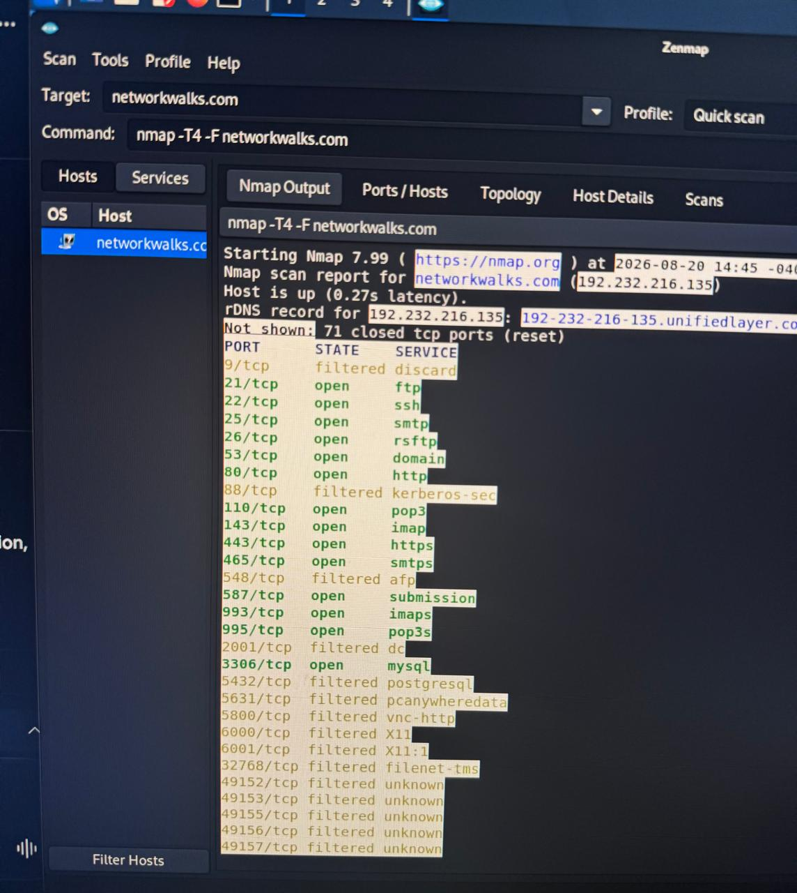
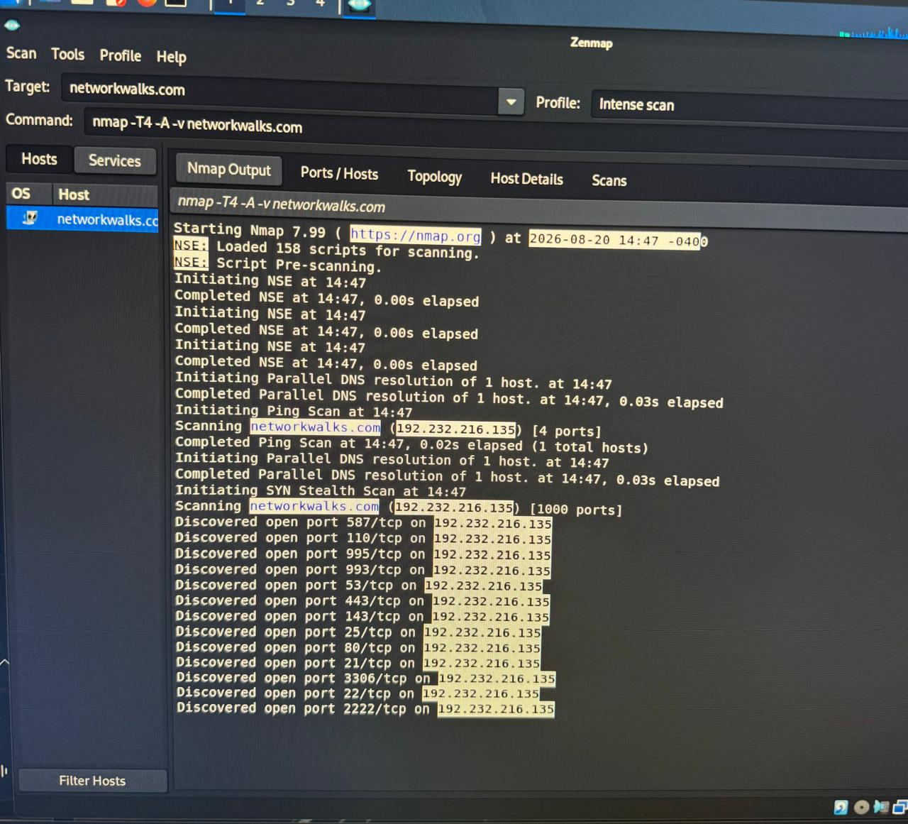
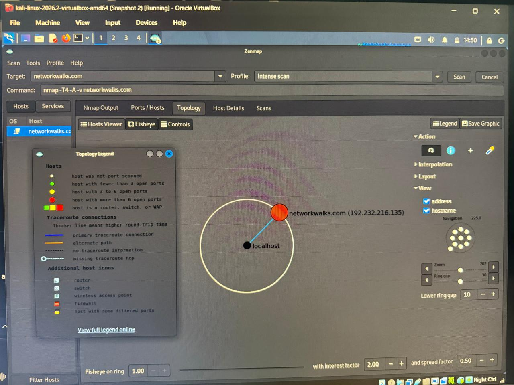

#  Penetration Test Report: Zenmap Network Scanning

  

| | |
|---|---|
| **Report ID** | PT-ZENMAP-2026-08-20 |
| **Target Domain** | `networkwalks.com` |
| **Assessment Tool** | Zenmap (Nmap GUI) v7.99 |
| **Environment** | Kali Linux 2026.2 (VirtualBox) |
| **Date** | 20 August 2026 |
| **Author** | Kovilen Sookalingum | 
| **Classification** | Confidential / Internal Assessment |

---

## ⚠️ Legal & Ethical Disclaimer

> This report is prepared exclusively for academic/project demonstration on a domain used for testing purposes. Network scanning must be performed **only** on systems you own or have **explicit written permission** to assess. Unauthorized scanning or testing against third-party targets is illegal and unethical.

---

## Table of Contents

1. [Executive Summary](#1-executive-summary)
2. [Tool Overview: Zenmap](#2-tool-overview-zenmap)
3. [Scan Execution & Screenshots](#3-scan-execution--screenshots)
4. [Findings](#4-findings)
5. [Attack Surface Analysis](#5-attack-surface-analysis)
6. [Recommendations](#6-recommendations)
7. [Conclusion](#7-conclusion)

---

## Executive Summary

A network reconnaissance assessment was performed against `networkwalks.com` using **Zenmap** (the graphical front-end for Nmap). Multiple scan profiles — Ping Scan, Quick Scan, and Intense Scan — were executed sequentially to identify live hosts, open ports, running services, and network topology.

**Key Findings:**

-  Host confirmed **active** with IP `192.232.216.135`
-  Multiple critical services exposed (FTP, SSH, SMTP, HTTP, HTTPS, MySQL)
-  Reverse DNS record: `192-232-216-135.unifiedlayer.com`
-  Network topology confirmed a direct connection between localhost and the target

---

## Tool Overview: Zenmap

| Attribute | Detail |
|---|---|
| **Version Used** | Nmap 7.99 via Zenmap GUI |
| **Developer** | Gordon Lyon (Fyodor), Nmap Project |
| **Functionality** | Host discovery, port scanning, service/version fingerprinting, OS detection, and topology visualization |

**Command Syntax Example:**

```bash
nmap -T4 -A -v networkwalks.com
```

---

##  Scan Execution & Screenshots

###  Tool Launch — *Environment Setup*



**Purpose:** Confirms the Zenmap application is available in the Kali Linux application menu, verifying the environment setup and tool availability.

---

### Target Configuration — *Configuration*



**Purpose:** Zenmap GUI configured with target `networkwalks.com`, scan profile set to **Intense Scan**.

**Command generated:**
```bash
nmap -T4 -A -v networkwalks.com
```

---

### Profile Selection



**Purpose:** Demonstrates the available scan profile options (Ping Scan, Quick Scan, Intense Scan, Intense Scan + UDP, Slow Comprehensive Scan, etc.), showing scan configuration flexibility.

---

### Ping Scan Results — *Host Discovery*



**Command:** `nmap -sn networkwalks.com`

**Output Summary:**
```
Host is up (0.0030s latency).
rDNS record for 192.232.216.135: 192-232-216-135.unifiedlayer.com
Nmap done: 1 IP address (1 host up) scanned in 1.81 seconds
```

**Purpose:** Confirms the host is up, records latency (~0.0030s), and identifies the reverse DNS record.

---

### Quick Scan Results — *Port Enumeration*



**Command:** `nmap -T4 -F networkwalks.com`

**Output Summary:** Multiple open ports discovered — FTP (21), SSH (22), SMTP (25), RSFTP (26), DNS (53), HTTP (80), POP3 (110), IMAP (143), HTTPS (443), SMTPS (465), Submission (587), IMAPS (993), POP3S (995), MySQL (3306) — along with several filtered ports (9, 88, 548, 2001, 5432, 5631, 5800, 6000, 6001, 32768, 49152–49157).

**Purpose:** Evidence of exposed services via fast port enumeration.

---

### Intense Scan Results — *Service Fingerprinting*



**Command:** `nmap -T4 -A -v networkwalks.com`

**Output Summary:** NSE loaded 158 scripts; SYN Stealth Scan performed against 1000 ports, discovering open ports on `192.232.216.135` including 21, 22, 25, 53, 80, 110, 143, 443, 587, 993, 995, 2222, and 3306.

**Purpose:** Service/version fingerprinting and deeper reconnaissance, including detection of the alternate SSH port (2222/tcp).

---

### Topology Visualization — *Network Mapping*



**Purpose:** The Zenmap Topology tab (with Legend enabled) visually confirms a direct traceroute connection between `localhost` and `networkwalks.com (192.232.216.135)`. The red node indicates a host with more than 6 open ports.

---

## Findings

### Host Information

| Attribute | Value |
|---|---|
| **IP Address** | 192.232.216.135 |
| **Reverse DNS** | 192-232-216-135.unifiedlayer.com |
| **Status** | Host is up |

### Open Ports & Services

| Port | State | Service |
|------|-------|---------|
| 21   | Open  | FTP |
| 22   | Open  | SSH |
| 25   | Open  | SMTP |
| 26   | Open  | RSFTP |
| 53   | Open  | DNS |
| 80   | Open  | HTTP |
| 110  | Open  | POP3 |
| 143  | Open  | IMAP |
| 443  | Open  | HTTPS |
| 465  | Open  | SMTPS |
| 587  | Open  | Submission |
| 993  | Open  | IMAPS |
| 995  | Open  | POP3S |
| 3306 | Open  | MySQL |
| 2222 | Open  | Alternate SSH |

**Observation:** Multiple critical services are exposed, including administrative (SSH, MySQL), mail (SMTP, POP3, IMAP), and web (HTTP/HTTPS) services.

---

## Attack Surface Analysis

| Finding | Risk Level | Implications |
|---|---|---|
| FTP (21/tcp) | ⚠️ High | Often misconfigured; risk of credential leaks |
| SSH (22/tcp, 2222/tcp) | ⚠️ High | Brute force or outdated SSH versions vulnerable |
| SMTP/POP3/IMAP services | ⚠️ High | Email relay abuse, phishing, credential theft |
| HTTP/HTTPS (80/443) | ⚠️ Medium | Web application vulnerabilities possible |
| MySQL (3306/tcp) | 🔴 Critical | Direct database exposure; risk of data breach |
| Multiple filtered ports | ℹ️ Info | Indicates firewall presence, partial protection |

---

## Recommendations

### For the Domain Owner

- **Restrict Access:** Limit SSH/MySQL to internal IP ranges or VPN.
- **Patch & Update:** Ensure all services (cPanel, MySQL, mail servers) are updated.
- **Email Security:** Harden SMTP with SPF, DKIM, DMARC; enforce TLS.
- **Web Application Security:** Perform a vulnerability assessment on HTTP/HTTPS endpoints.
- **Firewall Rules:** Block unused ports; enforce strict ACLs.
- **Continuous Monitoring:** Regularly run Nmap/Zenmap scans to detect new exposures.

### For Further Testing (Authorized Only)

- Run vulnerability scans against exposed services.
- Perform banner grabbing to identify exact software versions.
- Conduct brute-force simulation on SSH/FTP with explicit permission.
- Audit MySQL for weak authentication and exposed databases.

---

## Conclusion

The Zenmap assessment of `networkwalks.com` revealed a host with multiple critical services exposed, including FTP, SSH, SMTP, HTTP/HTTPS, and MySQL. These findings represent significant attack vectors if left unprotected. Defensive measures should prioritize restricting access, patching services, and hardening configurations.

---


---

*This report was generated for educational and authorized security assessment purposes only.*
